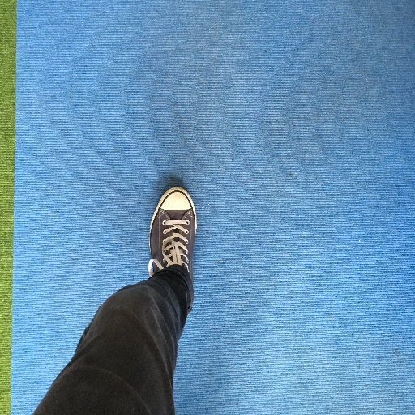

# Foot Renderer
A data synthesizer for creating datasets of feet from a first-person perspective.

  
  

We threw this project together as part of the talk: [Creating an Augmented Reality Football Game in a weekend](https://www.youtube.com/watch?v=FiJc1Fh4ros).  This project is currently setup to generate images and [segmentation masks](https://en.wikipedia.org/wiki/Image_segmentation) to be used in training a foot detector.

We have included a few feet, floors, and leg textures to get started training a prototype foot detector.  This project should be taken as a jumping off point for data synthesis rather than a production-grade solution.

## Getting Started
Open the xcode project, build, and run to start generating feet.

  

### Directory structure
- **FootRenderer/** (source for renderer)
- **FootRenderer.xcodeproj** (Xcode project)
- **input/** (images used in synthesis: floors, feet)
- **output/** (synthesized dataset)

## Author

This project was created by Laan Labs. We design and build solutions at the intersection of Computer Vision and Augmented Reality.

[http://labs.laan.com](http://labs.laan.com)

[@laanlabs](https://twitter.com/laanlabs)

## License

FootRenderer is released under the MIT License. See [LICENSE](LICENSE) for details.